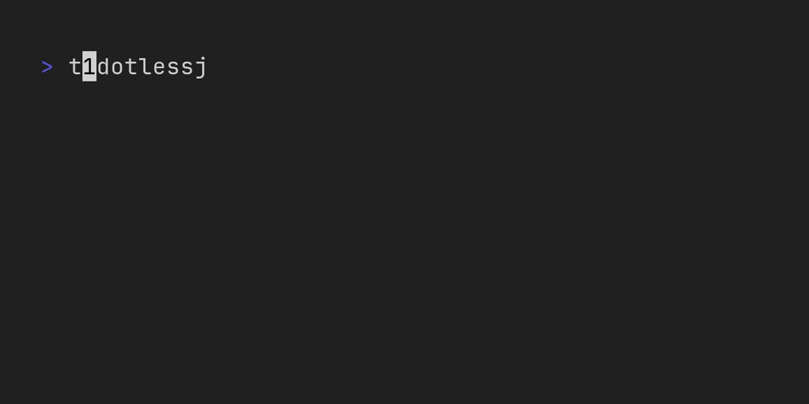

<p align="center">
	
	<a href="https://vhs.charm.sh">
		
	</a>
</p>

# timerrs

`timerrs` is a simple timer for the terminal

Inspired by [timer](https://github.com/caarlos0/timer).

## Installation

### From Source

Ensure you have [Rust and Cargo](https://rustup.rs/) installed.

```bash
git clone https://github.com/Aethar01/timerrs.git
cd timerrs
cargo build --release
```

### For Arch based systems

A package for timerrs can be found on the AUR [here](https://aur.archlinux.org/packages/timerrs), or use your favourite AUR helper (yay, paru, etc.):

```bash
yay -S timerrs
```

## Usage

```
A simple timer for the terminal

Usage: timerrs [OPTIONS] <DURATION>

Arguments:
  <DURATION>  Duration of the timer (e.g., "5m", "30s", "1h")

Options:
  -n, --name <NAME>    Name of the timer
  -c, --color <COLOR>  Color of the filled progress bar [default: white]
  -f, --fullscreen     Run the timer in fullscreen mode (clears terminal and centers UI)
  -v, --verbose        Enable verbose logging
  -s, --no-status      Disable the status bar
  -N, --notify         Enable dunst notifications with progress bar
  -h, --help           Print help
  -V, --version        Print version
```

### Keybinds

| Key      | Action                 |
| ---      | ---                    |
| `q`      | Quit the timer         |
| `esc`    | Quit the timer         |
| `ctrl+c` | Quit the timer         |
| `p`      | Pause/Resume the timer |
| `space`  | Pause/Resume the timer |

## timerrsctl

`timerrsctl` is a tool to control running `timerrs` instances.

### Usage

```bash
timerrsctl <NAME> <COMMAND>
```

### Commands

| Command | Action                 |
| ---     | ---                    |
| `pause`  | Pause the timer        |
| `resume` | Resume the timer       |
| `toggle` | Pause/Resume the timer |
| `quit`   | Quit the timer         |

Note: `timerrsctl` only works if the `timerrs` instance was started with a `--name`.

## License

This project is licensed under the MIT License - see the [LICENSE](LICENSE) file for details.
